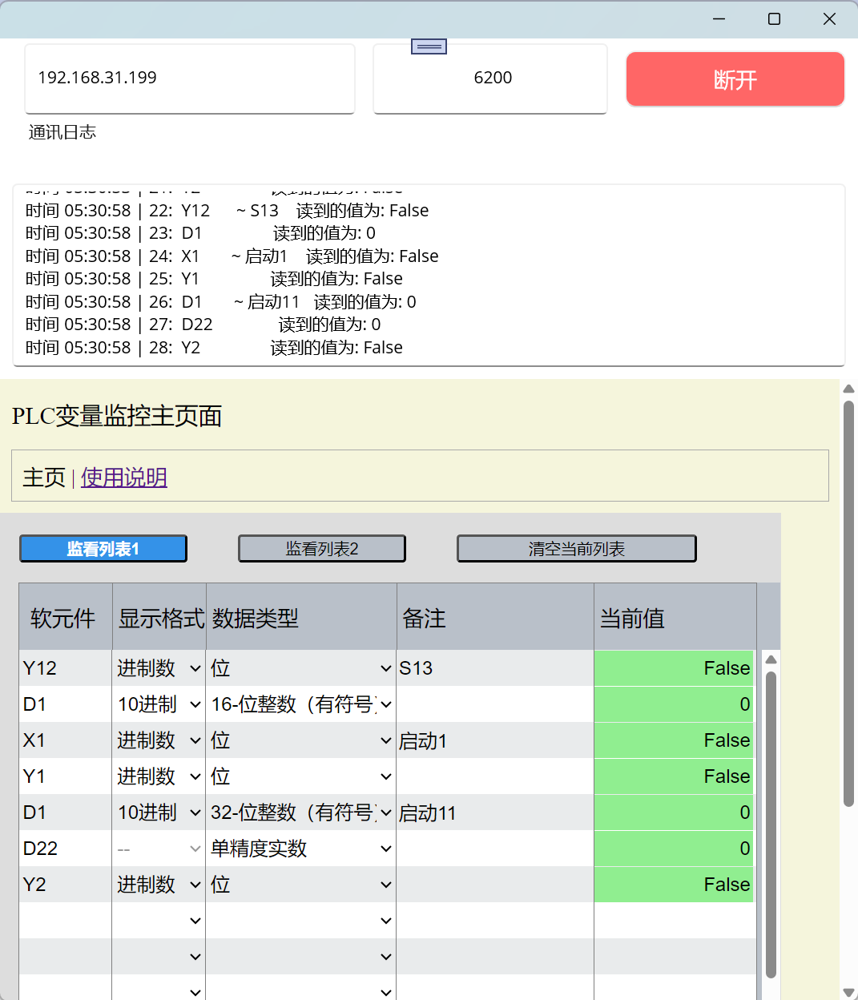

# mitsubishiPLCTestTool
A PLC signal monitoring tool ，一个现场调试用的PLC信号监看工具。

## 三菱PLC TestTool 功能使用说明 ##  

程序是基于.Net MAUI framework，代码参考了如下仓库

https://github.com/Eilon/MauiHybridWebView

1 下载此仓库ZIP文件，解压缩。  

2 把安装包文件夹下的APK安装包安装到手机。  

3 源代码在 source code 文件夹下，有需求的可自行修改测试。

4 里面有冗余代码，包含数据库、扫码相关测试。工具监视页面实际用的是浏览器的本地存储来记录数据

界面如下，程序可编译Android，iOS等平台运行，目前只在win11跟Android测试过。

手头目前只有FX5UC这一款三菱的PLC测试，改天有空，手头有西门子的PLC再改个西门子PLC测试工具

写这个只是方便现场调试人员，因为自己曾经拿个电脑爬上爬下核对信号等，没有合适工具，觉得很不方便